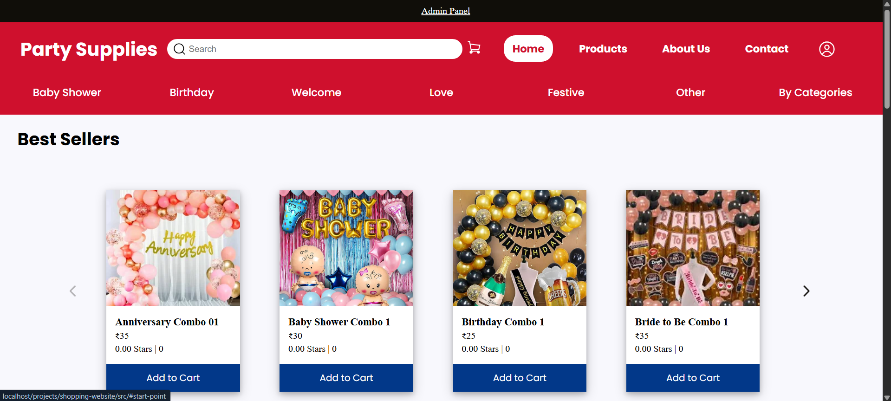
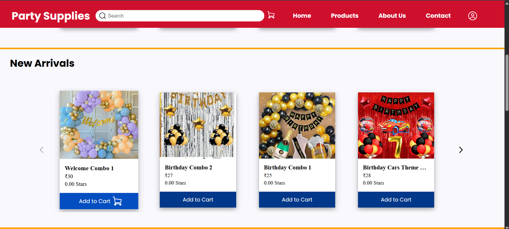
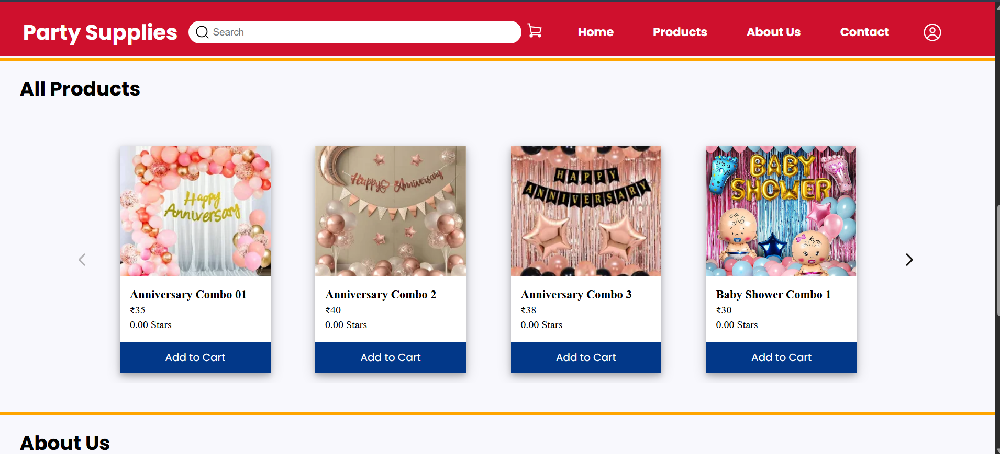
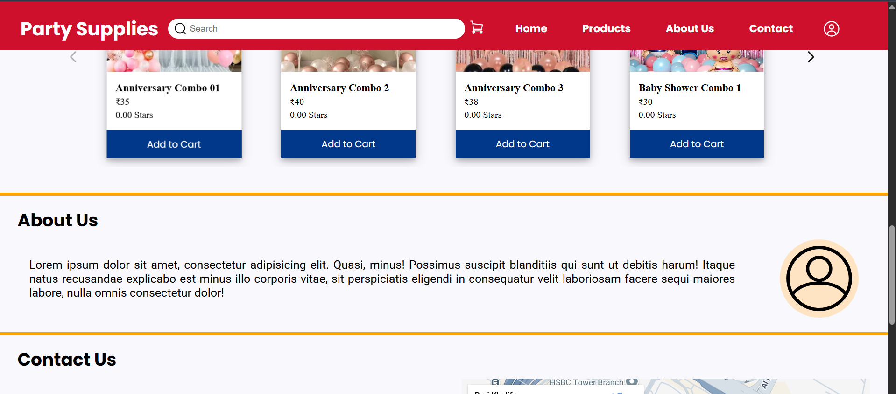
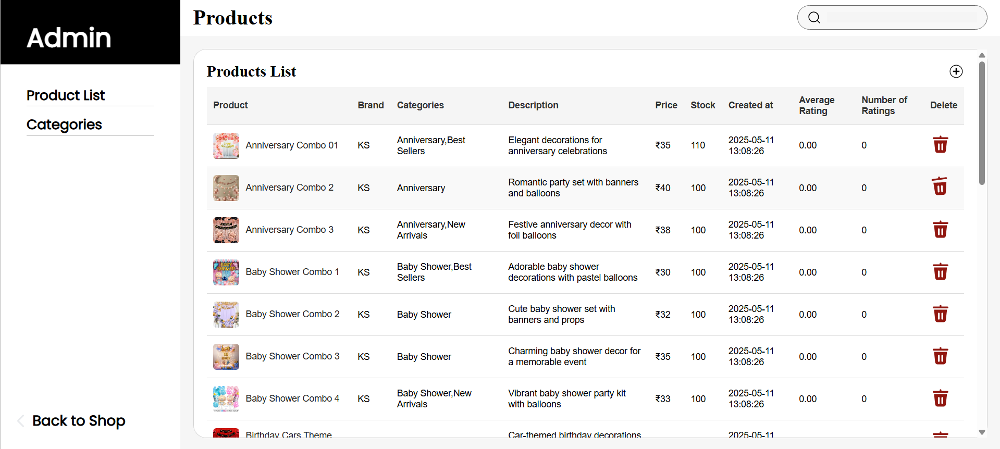

# Funshine – Party Supplies E-commerce
 
**Tech Stack:** PHP, MySQL, JavaScript, HTML/CSS

## 🛍 Features
- Dynamic product showcase (Best Sellers, New Arrivals)
- Product detail pages
- Add to Cart
- Admin panel:
  - Add/Edit/Delete products & categories
- Category system (many-to-many)
- Ratings & Reviews (per user per product)

## 🗂 Database Schema
- `products`: prod_id, name, img, desc, price, stock, created_at, rating
- `categories`: category_id, name
- `product_categories`: many-to-many link
- `reviews`: user_id, prod_id, rating, text, date
- `users`: id, name, email, phone, password (hashed)
- `cart`: user_id, prod_id, quantity
- `orders`: order_id, customer_id, products, status, payment

## 📸 Screenshots

